# Doku um die Präsi zu erstellen

## 0. Prerequisites
Falls ihr selber nochmal die ganzen Bilder die ich nicht gepusht habe
generieren wollt, oder selber evaluieren oder so, benötigt ihr:
1. Python ^= 3.10
2. poetry

Poetry venv installieren mit:
```
poetry install
```
Danach files ausführen mit:
```
poetry run python pipeline/train/preprocess.py # Beispiel
```

In den Notebooks steht mittlerweile nichts sinnvolles mehr drin, die habe ich
nur zum rumexperimentieren benutzt.

Alles was für uns relevant ist steht mittlerweile in `/pipeline/`.


## 1. Data Preprocessing
```
pipeline/train/preprocess.py
```
1. Wir hatten noch die zusätzlichen Bilder und Labels aus dem kip2 repo, die
   ich versehentlich gelabelt habe. Insgesamt hatten wir also 60 Bilder +
   Labels. Ich habe diese unterteilt in train/val/split, siehe
   `data/training/*/raw`. Train: 70% (42), Val: 20% (12), Test: 10% (6)

2. Dann das Preprocessing wie in den Notebooks beschrieben:
    1. ROI cropping: -> `data/training/*/cropped`
    2. Resizing: -> `data/training/*/resized`
    3. Augmentierung -> `data/training/*/augmented`

3. Zur Augmentierung: Ich habe da für jedes Bild folgendes vorgenommen:
- Rotate: -> jedes der Bilder wird jeweils um die Winkel [-3, -2, -1, 0, 1, 2, 3] gedreht
    - Für jedes dieser gedrehten Bilder mache ich folgende augmentierung:
        1. Nichts
        2. H-Flip
        3. V-Flip
        4. H-Flip + V-Flip (entsprivht Drehung um 180Grad)
- Es ergibt sich ein datensatz von 1680 Bildern (summiert aus train/val/test)
- Ich habe auch nur rotations trainiert. (siehe 2. Training)

Wir haben auch mit Noise, Kontrastverstellung und Gaussian Blur rumprobiert,
aber haben diese Modelle wieder verworfen, weil sie am Ende schlechter performt
haben auf den Test daten. Ist auch irgendwie logisch, weil das Netz lernt
generalisieren aber verschwommene Bilder oder körnige Bilder ähneln den Test
daten überhaupt nicht. Die Generalisierung die er beim Flippen und Rotieren
lernt sind ausreichend.

Ich habe auch zusätzlich overlays generiert, da sieht man die labels, die kann
man evtl auch für die präsi verwenden. Pushe die auch.


## 2. Training
```
pipeline/train/train.py
```
Insgesamt wurden bestimmt über 10 Netze trainiert aber ich schlage vor für die
Präsi beschränken wir uns auf den finalen run mit `correct_split_only_rotations`
und `correct_split_all_augmentations`.

- Hier haben wir uns an die im Notebook vorgegebene Netz-Architektur gehalten.
- Im Training zusätzlich Early Stopping und Checkpointing implementiert
- Training des finalen Netzes: 20 Epochen, je ca. 30min -> 10h (nur cpu)
- Hier sind die 2 loss plots für 1. correct_split_all_augmentations und 2.
  correct_split_only_rotation:

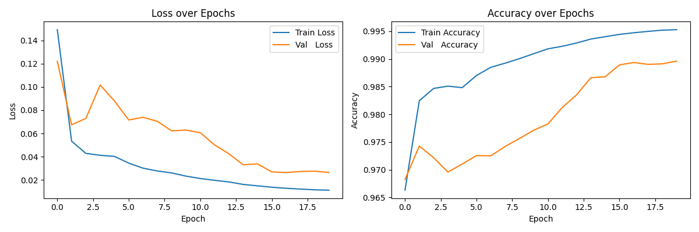
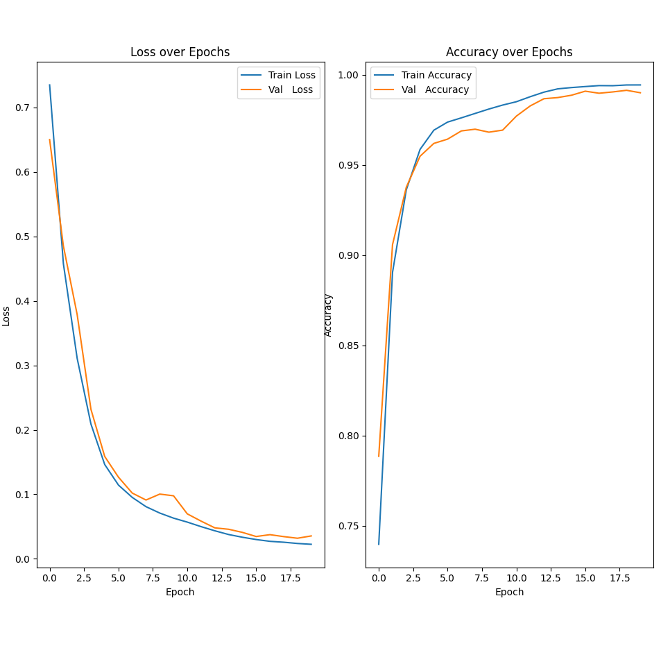


## 3. Evaluation
```
pipeline/eval/eval.py
```
Hier haben wir mit den TestDaten evaluiert, also auf den 6 ungesehenen Bildern.

- Eval mit IoU auch so wie in den Notebooks (jaccard_score):
    - all augmentations: (rotation zw -3 und 3, je mit h, v, h+v)
        - IoU: 0.7995645707802462
    - only rotation: (rotation zw. -3 und 3)
        - IoU: 0.7350793416367187
    - reference: (das netz was die uns geben)
        - IoU: 0.17898034672073565 (was? :D)

Die Ergebnisse der Eval findet ihr unter: `pipeline/eval/results`:

All Aug:
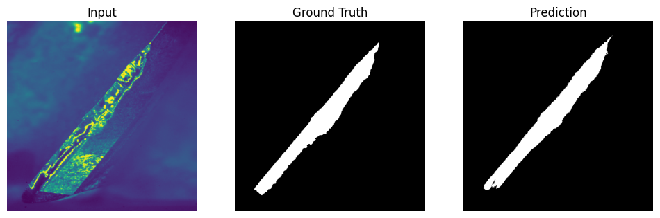
Only Rot:
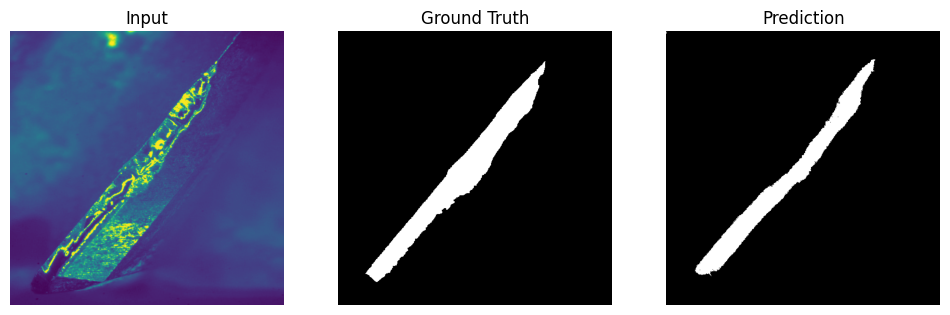
Referenz:
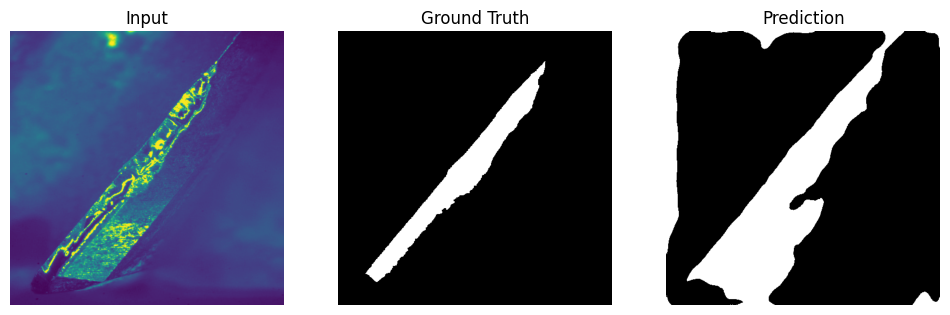


<!-- Später ist mir aufgefallen, dass obwohl die IoU besser ist bei all -->
<!-- augmentations, dass das netz mit nur rotation aber besser tut beim wear -->
<!-- measurement! -->


## 4. Wear Measurement Preprocessing
```
pipeline/wear_measurement/preprocess.py
```
1. Aligning (hab ich mir nicht angeschaut, hab da straight benutzt was GPT mir
   gegeben hat und hat gut gefunzt, params könnt ihr aus der File rauslesen)
2. Cropping
3. Resizing

Ich habe die Bilder alle hier hochgeladen. Ihr könnt vllt ein gif machen aus
den unalignten bildern und den alignten, damit man den Unterschied sieht.
Liegen unter `data/test/Images/images` bzw. `data/test/Images/aligned`.


## 5. Wear Measurement Inferenz
```
pipeline/wear_measurement/inference.py
```
Hier findet die Inferenz statt. 

Anschließend werden die Predictions mit
find_contours auf den größte zusammenhängen Fetzen reduziert. Zuletzt findet
noch eine morphologische CLOSE und anschliessend OPEN operation statt. Die
können wir uns auch sparen, weil wir am ende auch durch löcher durchmessen.
braucht ihr auch nicht erwähnen in der präsi. Hab das nur gemacht damit die
labels schöner aussehen.

Ihr findet alle Predictions unter `data/inference/Images/predictions*` bzw.
`data/inference/Images/cleaned_predictions*`. Ich hab auch zusätzlich overlays
jeweils für alle predictions und alle cleaned predictions generiert, vllt wollt
ihr die auch benutzen, liegen in den entsprechenden ordnern.

UPDATE 1: Ich werde den teil mit dem grossen fetzen finden und OPEN und CLOSE
nicht anpassen. Der typ hat ja gemeint, dass wir kein postprocessing machen
sollen auf den Bildern. Aber unser "postprocessing", dient uns als ROI
selection. Das funktioniert auf unseren Predictions gut, weil wir schon nah
genug an der GT dran sind.

UPDATE 2: Das mit dem cleaning funktioniert nicht mit denen ihrem schrottigen
Netz, weil es so scheisse performt, dass alles ein schrottiger
zusammenhängender unbrauchbarer fetzen ist (siehe eval bilder). Ich mach mir
nicht die mühe da nochmal drauf zu messen.


## 6. Wear Measurement
```
pipeline/wear_measurement/wear_measurement.py
```
1. Hier zuerst den korrekten winkel finden mit dem wir messen wollen. Dazu
  finden wir die kanten mit canny edge detection in allen bildern
    - Wir nehmen den Median als gerade von der wir aus messen
    - Das funktioniert semi gut
    - In Wahrheit hab ich hier gepfuscht, weils vollkommen banane ist, wenn wir
      eh alle images aligned haben und alle den selben winkel haben.
    - Ich habe den Winkel ausgemessen und auf 55.78Grad gesetzt
2. Danach suchen wir von der kante aus die breiteste stelle in der maske und
   das ist unser ergebnis je frame
3. die kanten sortieren (jeweils 4 aufeinanderfolgende bilder die zu den
   jeweiligen 4 schneiden gehören, und das im 8 frame takt, sieht man an den
   Bilder-Filenamen)
4. plotten der ergebnisse über die schnittnummern, einmal alles in einem diagramm
5. dann nochmal in einzelnen diagrammen, dort mit dbscan die outlier markiert,
   parameter für DBSCAN: `DBSCAN(eps=15, min_samples=3)`

### Ergebnisse von diesen Schritten:
1. Für `all_augmentations`:
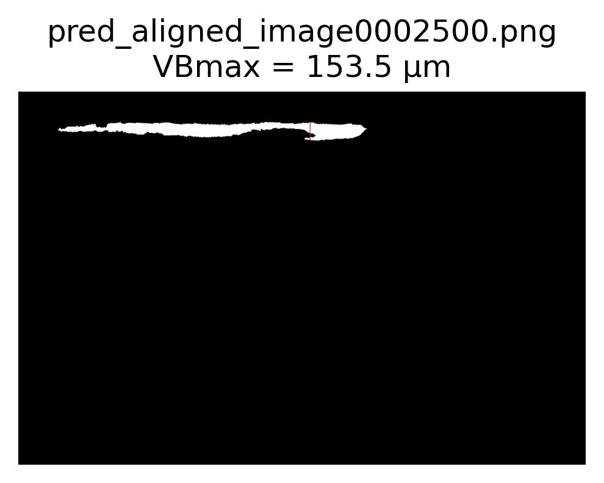
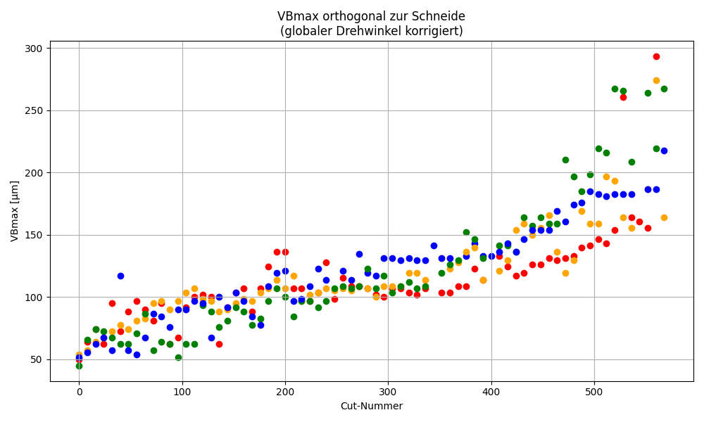
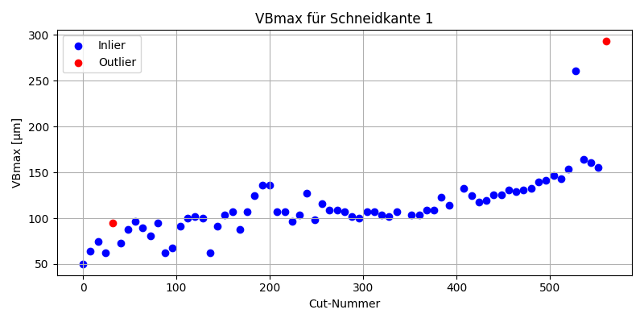
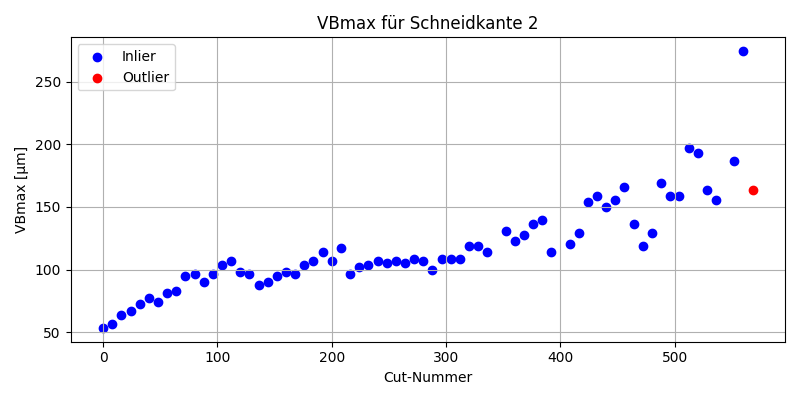
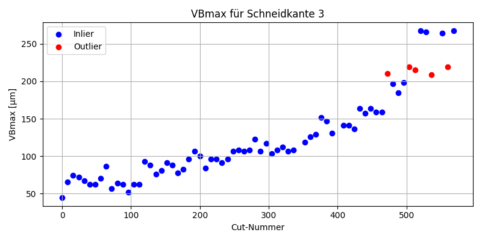
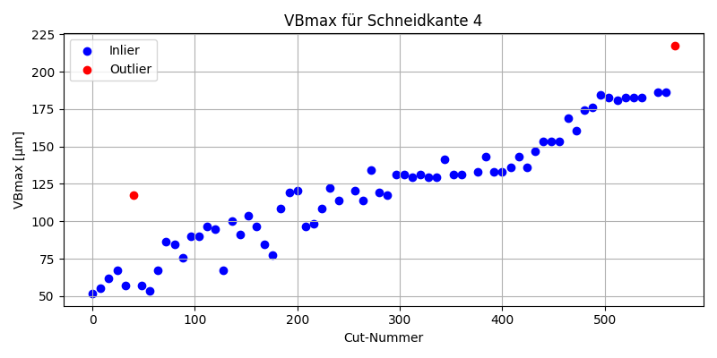

2. Für `only_rotation`:
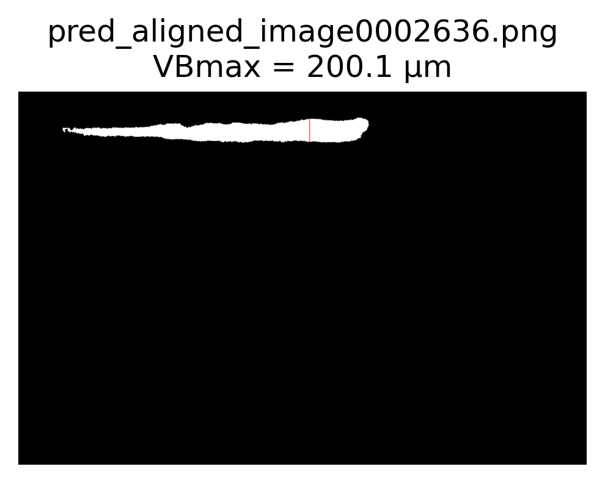
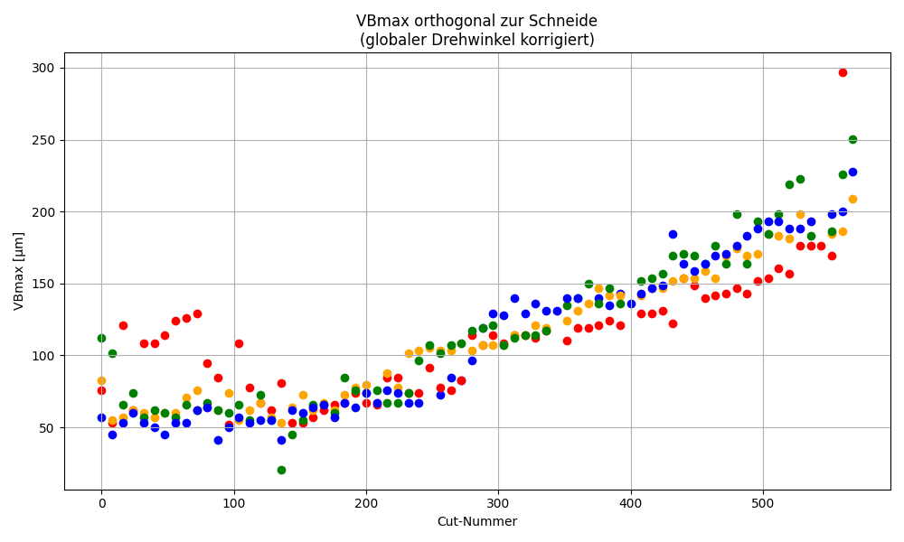
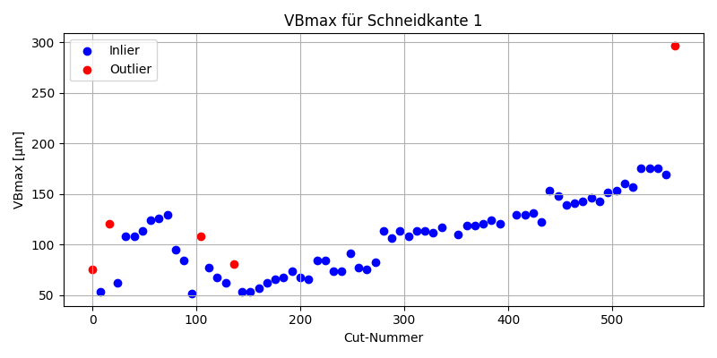
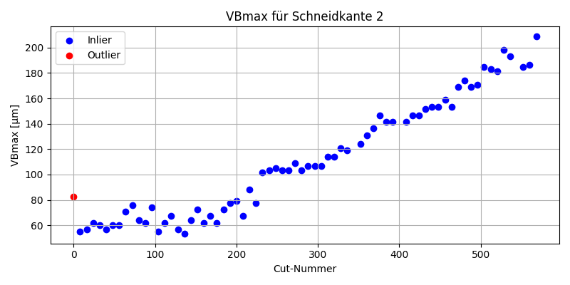
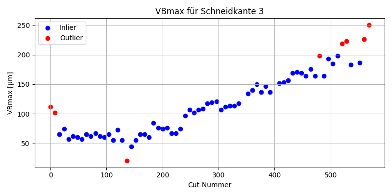
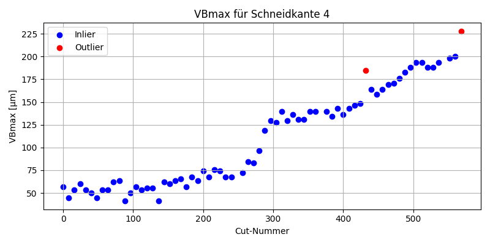

- Ich habe auch die Messungen visualisiert und für die einzelnen schneidekanten
  sortiert. Die sind unter `data/inference/wear_measurement_*/<1-4>`. Ihr könnt
  hier auch vllt gifs erstellen.

## 7. Video
```
pipeline/video/preprocess.py
```
1. Preprocessing:
    - hier habe ich mich nicht an die vorgaben aus dem Notebook gehalten, die
      war wieder vollkommen overkill.
    - ich bin stattdessen zur Extraktion folgendermaßen vorgegangen:
        - im 17. Frame sieht man das erste mal die 1. schneide gut.
        - danach folgt jedes 60. Frame wieder ein gut sichtbare schneide
        - die sind nicht perfekt aligned, aber genau das mache ich später ja
          mit dem image alignment, was wir vorher schon implementiert hatten
2. Danach halte ich mich genau an die pipeline von image processing, also
    1. `wear_measurement/preprocess.py` -> align, crop, resize
    2. `wear_measurement/inference.py` -> predictions, cleaned_predictions
    3. `wear_measurement/wear_measurement.py` -> wear_measurement ergebnisse
       (DBSCAN hier ausgeschaltet, weil zu wenige samples für sinnvolles
       clustering)

Die Ergergebbnisse vom wear_measurement findet ihr unter
`data/test/Video/video0000030/wear_measurement_*` &
`data/test/Video/video0000031/wear_measurement_*`.


## 8. Welches Netz ist jetzt besser?
Mir ist aufgefallen, dass das all_aug netz am Anfang besser performt. Also mit
anfang meine ich die bilder in denen die schneidekanten noch fast heile sind.
Bei stark zerstörten kanten performt das netz mit only_rot besser. Das habe ich
so beim überfliegen der overlays festgestellt, aber nicht genauer untersucht.
Ihr könnt das ja nochmal genauer untersuchen und das iwie graphisch in der
präsi festhalten. das sieht man in den overlays gut aber auch in den vb_meas
diagrammen aus den wear_measurement ergebnissen.
