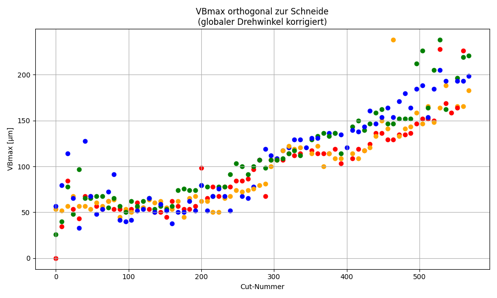
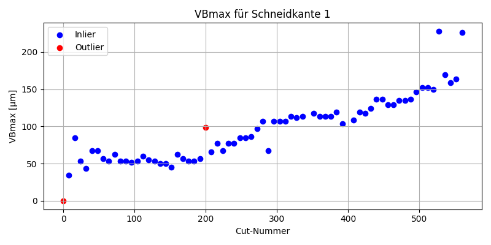
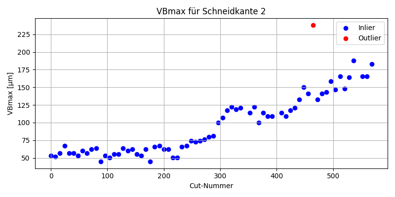
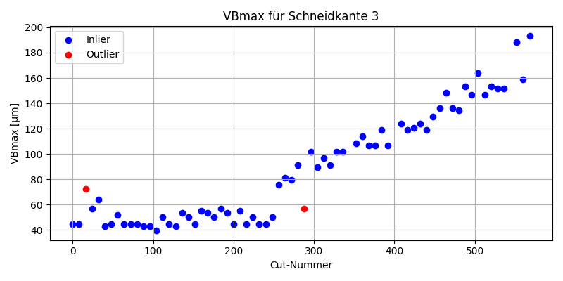
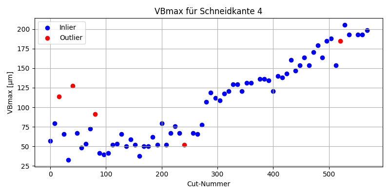
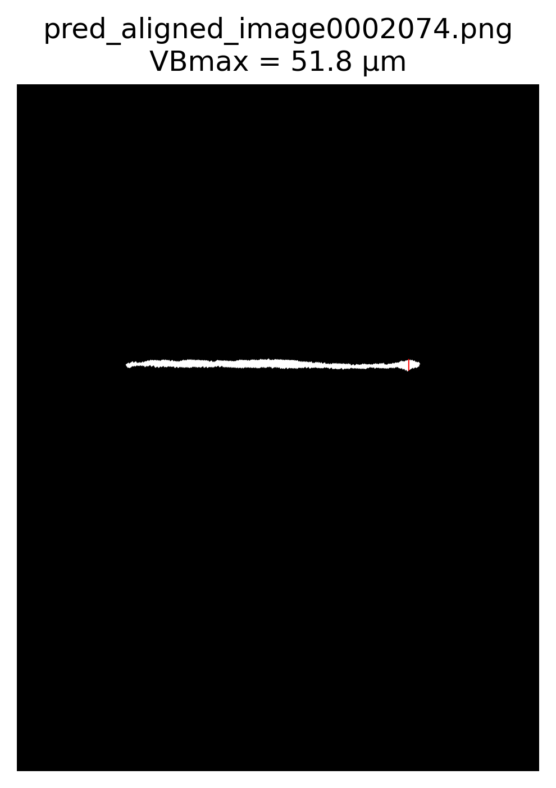
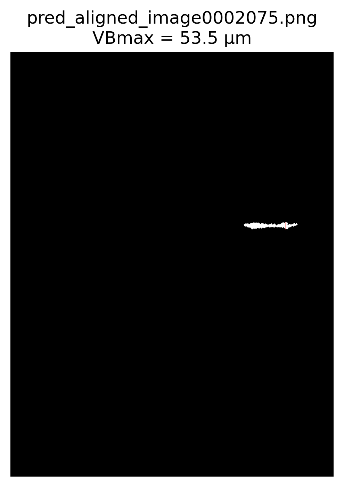
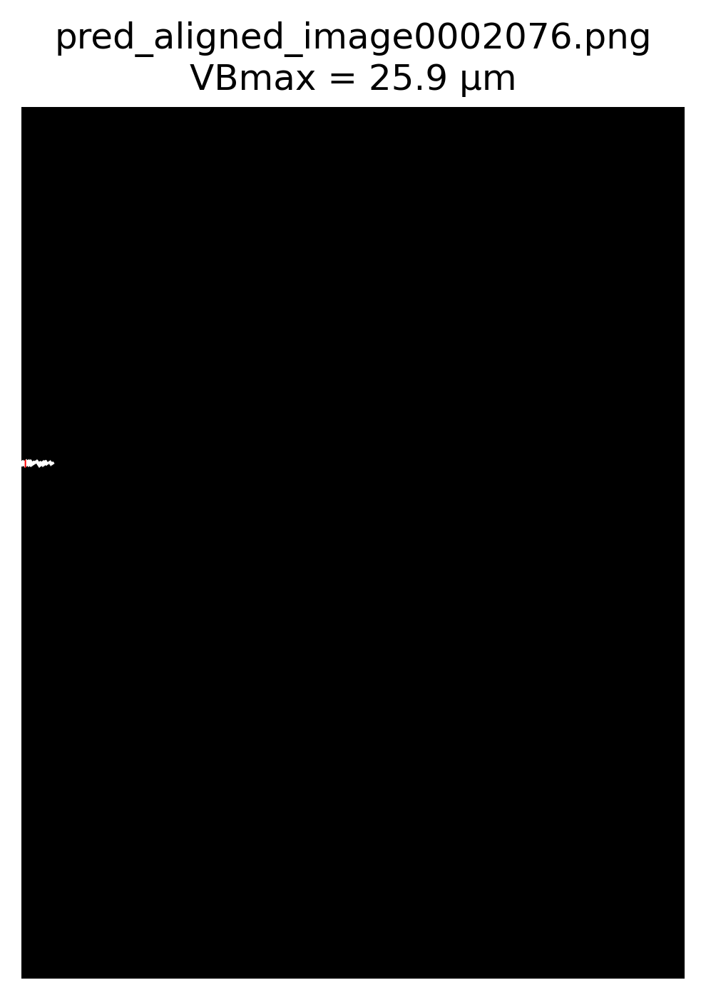
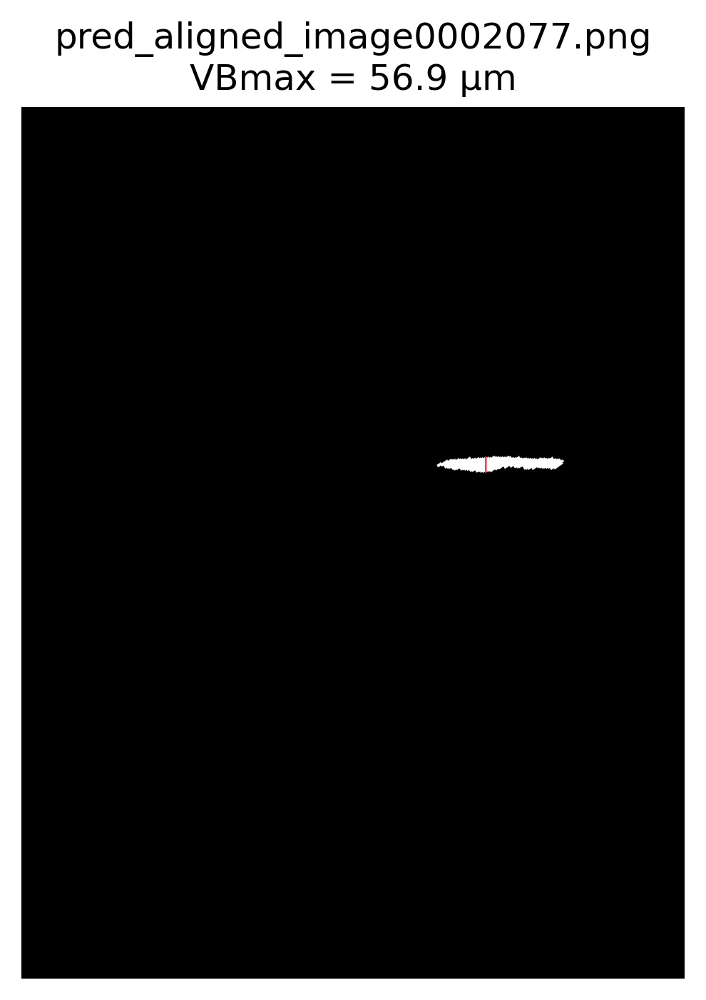

# Doku um die Präsi zu erstellen

## 0. Prerequisites
Falls ihr selber nochmal die ganzen Bilder die ich nicht gepusht habe
generieren wollt, oder selber evaluieren oder so, benötigt ihr:
1. Python ^= 3.10
2. poetry

Poetry venv installieren mit:
```
poetry install
```
Danach files ausführen mit:
```
poetry run python pipeline/train/preprocess.py # Beispiel
```

In den Notebooks steht mittlerweile nichts sinnvolles mehr drin, die habe ich
nur zum rumexperimentieren benutzt.


## 1. Data Preprocessing
```
pipeline/train/preprocess.py
```
Hier hatten wir eig nichts besonderes gemacht. Haben die Labels erstellt, die
angepasst. Ich habe für das Training später auch noch meine Labels die ich
versehentlich gelabelt hatte mit reingenommen.
- Labels unter: `data/train/all_images_and_labels`

Dann das Preprocessing wie in den Notebooks beschrieben:
1. ROI cropping: -> `data/train/all_images_and_labels_cropped`
2. Resizing: -> `data/train/all_images_and_labels_resized`
3. Augmentierung -> `data/train/all_images_and_labels_augmented`

Zur Augmentierung: Ich habe da für jedes Bild folgendes vorgenommen:
- Rotate: -> jedes der Bilder wird jeweils um die Winkel [-3, -2, -1, 0, 1, 2, 3] gedreht
    - Für jedes dieser gedrehten Bilder mache ich folgende augmentierung:
        1. Nichts
        2. H-Flip
        3. V-Flip
        4. H-Flip + V-Flip (entsprivht Drehung um 180Grad)
- Es ergibt sich ein Trainingsdatensatz von 3360 Bildern

Wir haben auch mit Noise, Kontrastverstellung und Gaussian Blur rumprobiert,
aber haben diese Modelle wieder verworfen, weil sie am Ende schlechter performt
haben auf den Test daten. Ist auch irgendwie logisch, weil das Netz lernt
generalisieren aber verschwommene Bilder oder körnige Bilder ähneln den Test
daten überhaupt nicht. Die Generalisierung die er beim Flippen und Rotieren
lernt sind ausreichend.

Ich habe auch zusätzlich overlays generiert, da sieht man die labels, die kann
man evtl auch für die präsi verwenden. Pushe die auch.


## 2. Training
```
pipeline/train/train.py
```
- Hier haben wir uns an die im Notebook vorgegebene Netz-Architektur gehalten.
- Wir haben einen Train-Val Split von 70/30 genommen, weil wir mehr Daten durch
  die umfangreiche augmentierung hatten.
- Im Training zusätzlich Early Stopping und Checkpointing implementiert
- Weil wir so einen großen Datensatz haben fällt innerhalb der ersten 2 Epochen
  bereits der Loss unter 0.1
- Training des finalen Netzes: 10 Epochen, je 30 min -> 5h
- Metriken und lossplot fürs beste Netz fehlen noch, reiche ich euch nach, TODO 
- Ich habe eine Reihe an Lossplots von den ganzen verschiedenen Trainings mit
  unterschiedlichen Trainingsdatensätzen und teilweise auch anderen Netzen die
  ich ausprobiert habe. Reich ich euch auch nach wenn ihr wollt. Ist vllt
  relevant für eine gute Note. Ich habe auch noch ganz einfache
  Netzarchitekturen implementiert.

## 3. Evaluation
```
pipeline/eval/eval.py
```
- Eval mit IoU auch so wie in den Notebooks (jaccard_score)
- Metrik fürs beste Netz geb ich euch # TODO


## 4. Wear Measurement Preprocessing
```
pipeline/wear_measurement/preprocess.py
```
1. Aligning (hab ich mir nicht angeschaut, hab da straight benutzt was GPT mir
   gegeben hat und hat gut gefunzt, params könnt ihr aus der File rauslesen)
2. Cropping
3. Resizing


## 5. Wear Measurement Inferenz
```
pipeline/wear_measurement/inference.py
```
Hier findet die Inferenz statt. Anschließend werden die Predictions mit
find_contours auf den größte zusammenhängen Fetzen reduziert. Zuletzt findet
noch eine open/close operation statt um löcher bzw inseln in den predictions zu entfernen.
- Ich generiere hierzu auch overlays die kann ich euch schicken


## 6. Wear Measurement
```
pipeline/wear_measurement/wear_measurement.py
```
1. Hier zuerst den korrekten winkel finden mit dem wir messen wollen. Dazu
  finden wir die kanten mit canny edge detection in allen bildern
    - Wir nehmen den Median als gerade von der wir aus messen
    - In Wahrheit hab ich hier gepfuscht und den Winkel einfach auf 55.78Grad gesetzt
      weils nicht gescheit gefunzt hat und ich keine lust hatte mich damit
      auseinanderzusetzen :D (aber schreibt das mit dem winkel finden tzd gern in
      die präsi, hört sich besser an)
2. Danach suchen wir von der kante aus die breiteste stelle in der maske und
   das ist unser ergebnis je frame
3. die kanten sortieren (jeweils 4 aufeinanderfolgende bilder die zu den
   jeweiligen 4 schneiden gehören, und das im 8 frame takt, sieht man an den
   Bilder-Filenamen)
4. plotten der ergebnisse über die schnittnummern, einmal alles in einem diagramm
5. dann nochmal in einzelnen diagrammen, dort mit dbscan die outlier markiert,
   parameter für DBSCAN: `DBSCAN(eps=15, min_samples=2)`
Ergebnisse von diesen Schritten:










## 7. Video
```
pipeline/video/preprocess.py
```
1. Preprocessing:
    - hier habe ich mich nicht an die vorgaben aus dem Notebook gehalten, die war unnötig.
    - ich bin stattdessen zur Extraktion folgendermaßen vorgegangen:
        - im 17. Frame sieht man das erste mal die 1. schneide gut.
        - danach folgt jedes 60. Frame wieder ein gut sichtbare schneide
        - die sind nicht perfekt aligned, aber genau das mache ich später ja
          mit dem image alignment, was wir vorher schon implementiert hatten
2. Danach halte ich mich genau an die pipeline von image processing, also
    1. `wear_measurement/preprocess.py` -> alignte bilder, cropped resized
    2. `wear_measurement/inference.py` -> predictions, cleaned_predictions
    3. `wear_measurement/wear_measurement.py` -> wear_measurement ergebnisse
